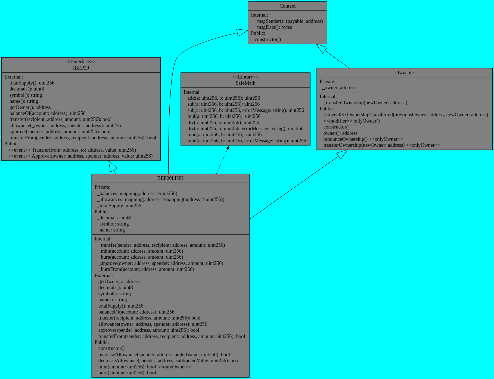
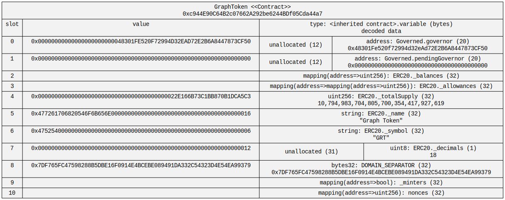

## Using the sol2uml tool to research the `store.sol` contract

This assignment uses a [Soliditi 2 UML Tool](https://github.com/naddison36/sol2uml)

To get started, use the command: 

```bash
sol2uml --help
```

## What can these tools do?

- create UML diagrams of contracts

Using our contract as an example, enter the command:

```bash
sol2uml class ./store.sol
```

Execution results in the creation of a .svg file. Using the Native SVG Preview application for VS Code we will see the following diagram:


You can also create a UML diagram using a contract folder or by directly specifying the address of the contract that has been deployed and verified. Using the options you can select the network, the format of the resulting file, and the colors. For example, take LINK token in BSC network:

```bash
sol2uml class 0xF8A0BF9cF54Bb92F17374d9e9A321E6a111a51bD -f png -n bsc -bc cyan -fc gray
```



- visually display a contract's storage slots

Using our contract as an example, enter the command:

```bash
sol2uml storage ./store.sol -c Store
```

Execution results in the creation of a .svg file. Using the Native SVG Preview application for VS Code we will see the following diagram:


We can also get the values of storage variables of the contract for a particular block (default: latest). Using the Graph Token (GRT) as an example:

```bash
sol2uml storage 0xc944E90C64B2c07662A292be6244BDf05Cda44a7 -d -u "PASS_THIS_YOUR_RPC_URL"
```

You can get RPC_URL on [Alchemy](https://www.alchemy.com/dashboard), for example.



- Merges verified source files for a contract from a Blockchain explorer into one local Solidity file (use flatten command)

- Compare verified contract code on Etherscan-like explorers to another verified contract, a local file or multiple local files (use diff command)

More [usage examples](https://github.com/naddison36/sol2uml/blob/master/examples/storage/README.md) can be found in the documentation.